# 📘 Technical Documentation – MVP UNO AI Game

---

## 1. 🎯 User Stories and Mockups

### User Stories (MoSCoW Prioritization)

| Priority    | User Story                                                                                                     |
|-------------|----------------------------------------------------------------------------------------------------------------|
| **Must**    | As a player, I want to play a full UNO game against the AI, so I can test the AI’s strategy and enjoy gameplay.|
| **Must**    | As a developer, I want the AI to choose the best card to play based on the current game state, for realism.    |
| **Must**    | As a player, I want to be able to register and log in, to save my progress and statistics.                     |
| **Must**    | As a player, I want to see my hand and the top card on the discard pile, so I can make informed choices.       |
| **Should**  | As a developer, I want the AI to learn from multiple simulated games, so it can improve over time.             |
| **Should**  | As a user, I want a dashboard showing game history and AI decision logs, to analyze its behavior.              |
| **Could**   | As a user, I want to adjust the AI difficulty, so I can choose between casual and competitive play.            |
| **Could**   | As a developer, I want to test different reward strategies for reinforcement learning, to compare their impact.|
| **Won't**   | Multiplayer mode                                                                                               |
| **Won't**   | Mobile version                                                                                                 |

### Mockups

Wireframes for:
- **Game Interface**
    - Player hand
    - Discard pile (top card visible)
    - Action buttons: Play / Draw / UNO!
    - AI’s card count
    - Turn indicator
- **Dashboard / Analytics**
    - Match history
    - Win/loss ratio
    - AI decision log per game (e.g., why it played that card)

*(Mockups to be created in Figma later.)*

---

## 2. 🧱 System Architecture


| Component             | Role                                                                                                 |
|-----------------------|------------------------------------------------------------------------------------------------------|
| **Front-End Web App** | Player interface (play card, view hand, see pile, check history).                                   |
| **Back-End API**      | Bridge between UI, game engine, AI, and databases. Handles game and analytics routes.               |
| **Game Engine**       | Manages simplified UNO rules, applies moves, checks win conditions.                                 |
| **AI Trainer**        | Simulates thousands of games to train an agent via reinforcement. Can run in background.            |
| **Database**          | Stores games, game states, AI metrics, and training logs. PostgreSQL recommended.                   |

### Data Flow (Simplified)
1. Player interacts with the front-end.
2. Front-end calls the back-end API to play a card or start a game.
3. Back-end calls the game engine to validate the move.
4. Game engine returns the updated game state.
5. AI plays its turn (if applicable) and move is returned via API.
6. States and results are saved in the database for dashboard/training.

---

## 3. 🧩 Components, Classes, and Database Design

### Key Components & Classes

- `GameEngine`: Manages game flow (turns, actions, rules).
- `Player`: Base class for human or AI players.
- `UNOCard`: Represents each card (color, type, value).
- `DeckManager`: Handles draw and discard piles.
- `AIPlayer`: Inherits `Player`, adds decision logic.

### Database Schema (PostgreSQL)

```sql
-- Table: games
id SERIAL PRIMARY KEY
date_created TIMESTAMP
result VARCHAR(10) -- win/loss/draw
total_turns INTEGER

-- Table: actions
id SERIAL PRIMARY KEY
game_id INTEGER REFERENCES games(id)
player_type VARCHAR(10) -- human/ai
card_played VARCHAR(20)
turn_number INTEGER

-- Table: ai_stats
id SERIAL PRIMARY KEY
model_version VARCHAR(20)
win_ratio FLOAT
total_games INTEGER
```

---

## 4. 🔁 Sequence Diagrams

### Sequence 1: Player Plays a Turn

**Actors:**  
User (Player) → Frontend (React) → Backend (FastAPI) → Game Engine → Database (PostgreSQL)


### Sequence 2: AI Makes a Move

**Actors:**  
Backend (FastAPI) → AI Engine → Game Engine → Database (PostgreSQL) → Frontend

```mermaid

sequenceDiagram
    participant B as Backend (FastAPI)
    participant AI as AI Engine
    participant G as Game Engine
    participant D as Database
    participant F as Frontend

    B->>AI: Detect AI's turn
    AI->>G: Choose best card
    G-->>AI: Validate AI move, update state
    AI->>D: Save AI move
    D-->>AI: Save successful
    AI-->>B: Return new state
    B-->>F: Auto-refresh UI (AI’s move shown)
    
```



---

## 5. 🌐 API Specifications

### External APIs

No external calls required (self-contained game).

### Internal API Endpoints (FastAPI)

| Method | Endpoint         | Description                        |
|--------|------------------|------------------------------------|
| POST   | `/game/start`    | Start a new game                   |
| POST   | `/game/play`     | Submit player action               |
| GET    | `/game/state`    | Get current game state             |
| POST   | `/game/ai`       | Make the AI play                   |
| GET    | `/stats`         | Get AI performance stats           |
| GET    | `/history/{id}`  | Get logs for a specific game       |

> 📦 All exchanges use JSON format.

---

## 6. 🛠️ SCM and QA Strategies

### Source Control Management (SCM)

- **Git** with GitHub as remote repository.
- **Branching strategy:**
  - `main`: stable, production-ready branch
  - `develop`: main development branch
  - `feature/<feature_name>`: new features
  - `bugfix/<bug_name>`: bug fixes
  - `release/<version>`: pre-release preparation (optional)
  - `hotfix/<patch_name>`: urgent production fixes
- **Workflow:**
  - Developers branch from `develop` for features/bugfixes.
    - Use clear, conventional commit messages (e.g., `feat: add card draw logic`).
  - Pull Requests (PR) to `develop` with mandatory code review.
  - Merge `develop` into `main` for releases.

**Recommended tools:**  
- GitHub for repository and PR management  
- GitHub Projects or Issues for progress tracking
### Quality Assurance (QA)

- **Automated tests:** Ensure code quality and rule validation.
- **Manual tests:** End-to-end gameplay and API checks.

| Test Type         | Tools             | Description                                      |
|-------------------|-------------------|--------------------------------------------------|
| Unit tests        | pytest, unittest  | Test core functions and game rules               |
| Integration tests | pytest, httpx     | Test FastAPI endpoints                           |
| Manual tests      | Postman, frontend | Full gameplay and API validation                 |
| AI logic tests    | Simulation scripts| Ensure AI follows rules and behaves correctly    |

### QA Strategy

- `pytest` for unit and functional tests
- Example test files: `test_game_engine.py`, `test_ai_behavior.py`
- Test coverage on game rules and AI
- Manual endpoint tests with Postman
- GitHub Actions for CI (optional)

---

## 7. ⚙️ Technical Justifications

| Decision                | Justification                                                                 |
|-------------------------|-------------------------------------------------------------------------------|
| **UNO vs Pokémon TCG**  | Simplified UNO allows a stable game engine in less time.                      |
| **FastAPI**             | Lightweight, fast, perfect for RESTful APIs.                                  |
| **PostgreSQL**          | Reliable, relational, ideal for storing games and actions.                    |
| **Python**              | Common for AI and backend, easy integration.                                  |
| **Git Flow**            | Clear organization between dev, features, hotfixes.                           |
| **Automated Tests**     | Validates rules reliably, essential for AI.                                   |
